# USTCop-Livecast
USTC舞萌比赛直播程序，基于OBS、Python和Node.js


[TOC]

------

## 准备工作

### 人员准备

- **主持人**：主持比赛，协助解说

- **直播控制**：负责开启直播、控制程序、OBS和B站直播姬

- **计分**：负责计分、登记选手等事项，一人即可，和直播共用一台电脑

- **场地**：负责移动手元相机，一人即可，必要时协调现场

> [!NOTE]
>
> 理论上四个工作人员即可，剩下的人可以协助他们的工作
>

### 设备准备

- **电脑**：建议使用CPU、网卡、显卡和磁盘都比较在线的Windows游戏本，磁盘至少20个GB的可用空间用来存放录制，建议检查USB和TypeC接口是否支持USB3.2以及充电协议
- **主摄**：能够直播主画面即可，用来呈现主持区域，我上次使用的是索尼微单相机，使用原厂连接线连接笔记本电脑以同时保持2k30p推流和供电，记得带三脚架

- **两个手元相机**：使用手机+DroidCam连接OBS进行直播，需要检查手机是否支持DroidCam使用，记得带上充电宝和充电器
- **蓝牙麦克风**：供主持使用，连接电脑作为直播期间唯一的麦克风输入，记得带上充电器

> [!NOTE]
>
> 岚窝有WIFI和电源，DroidCam需要在局域网下运行
>
> 舞萌的机台推流需要提前确认末端输出是HDMI还是USB，如果是HDMI还需要购买采集卡，如果是USB需要检查电脑接口是否支持数量和质量，以及检查OBS是否能识别信号，同时记得检查音频是否能成功采集以及音画是否同步
>
> 所有连接线记得带上备用件

## 场地和流程

### 场地设置


场地大致如图所示

- 休息区为四个两两相背的沙发
- 主视角是比赛的主直播画面（主摄像头画面），也是和主持人相对的方向
- ①、②、③为直播电脑放置的建议位置，选一个能够到连接设备并且不会妨碍到选手和工作人员的位置即可

> [!NOTE]
>
> 比赛当天人可能有点多而且声音很嘈杂，一定要注意保护好设备和店家的机器
>
> 右边舞萌是赛前预热准备的，如果左边的舞萌无法使用，把休息区沙发挪到①的右边去然后把右边舞萌前面空出来

### 流程安排

比赛分为五组，每组八位选手。为了方便选手安排时间，按照整组角逐的比赛方式，也就是**一组八位选手三轮选出冠亚军之后再进入到下一组比赛**

- 比赛的名单由预选赛得到，排除掉预选赛中重复出现的选手（一般保留高组别）选出前八名参加正赛
- 为方便选手安排时间，**比赛ABCDE组之间的顺序尚未确定**，在赛前若干天调查选手决定
- 选手需要知道的比赛流程：
  - 每组根据预选成绩前四名确定组别1234，后四名**抽签和前四名组成回合**，淘汰制晋级
  - 抽签在确定同组选手的同时进行，一般在比赛的几天前，确定对手之后可以准备**从曲库中选曲**，在自己回合进行时当场告诉主持人即可
  - 淘汰赛和半决赛每回合两首歌（互相选一首），**决赛除此之外追加一首自制初见谱**
  - 选手在当前场地没有比赛进行的时候都可以上机练习，抽签结束到比赛开始之间会预留热身时间

- 详细的流程：

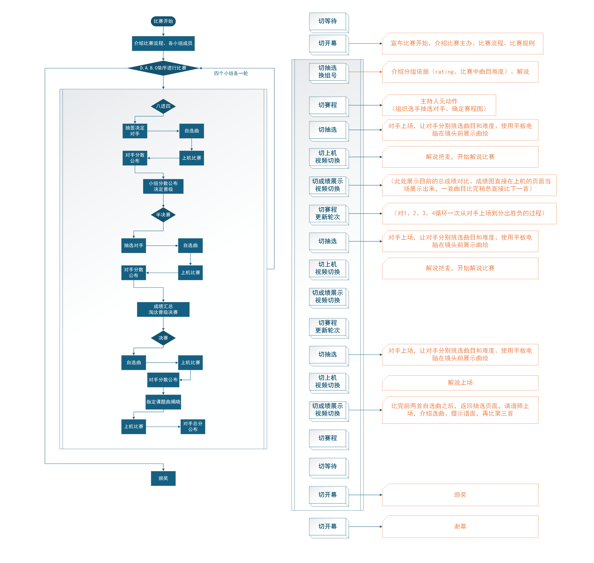

### 比赛规则

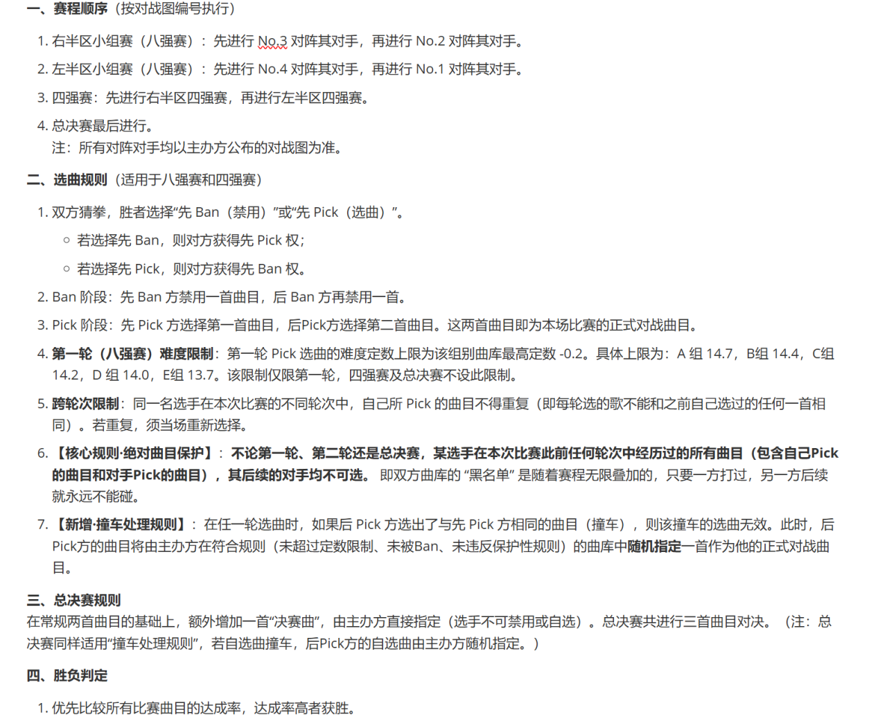

## 设备准备

首先直播需要有以下软件基础：

- OBS 28 或更新版本，并启用 WebSocket Server
- Node.js 18 或更新版本（自带 npm）
- Python 3.11 或更新版本

拥有上述软件之后即可克隆仓库，建议克隆到`E:\USTCop\`下保证原始兼容

### OBS设置

#### DroidCam

OBS需要安装插件：[DroidCam OBS Plugin](https://droidcam.app/obs/#top)

安装完成之后，重新启动OBS，应该可以看见”源“里面可以新建**DroidCam OBS**媒体源（注意不是DroidCam）

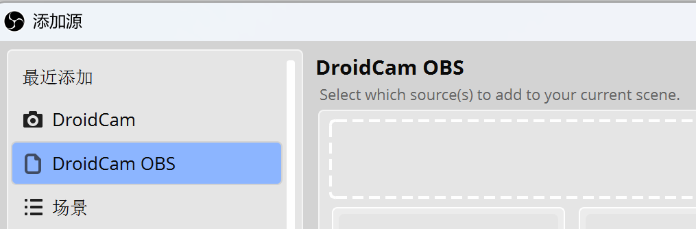

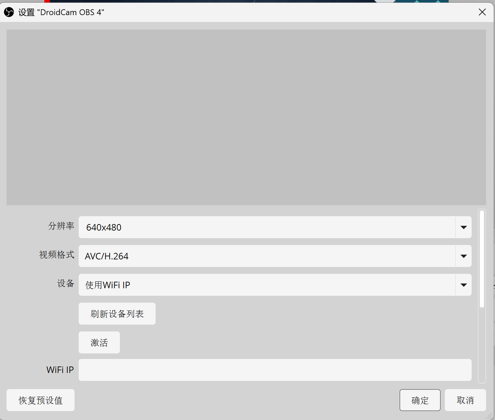

> [!NOTE]
>
> DroidCam需要在同一WiFi环境下使用，建议提前在手机上安装并测试DroidCam软件是否能成功推送画面
>
> 由于DroidCam使用裁切画质而不是差分画质，使用最低或者次低分辨率即可

#### 推流和被控制

使用OBS作为虚拟摄像头启动，在**哔哩哔哩直播姬**中监看OBS虚拟摄像头作为B站直播设置，可以添加透明弹幕窗格

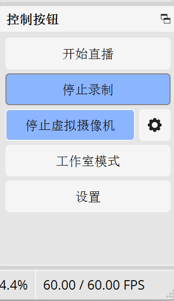

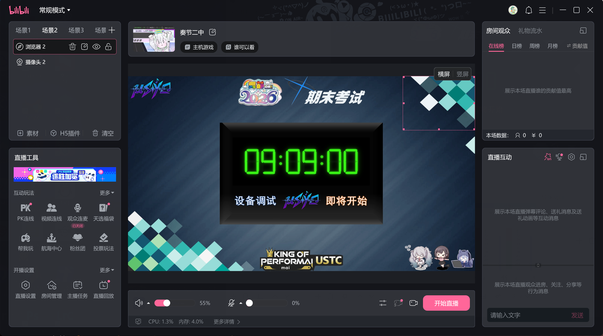

输出模式选择简单即可，视频编码器和预设根据自己电脑的状况选择（也就是哪个卡顿就换另一个）

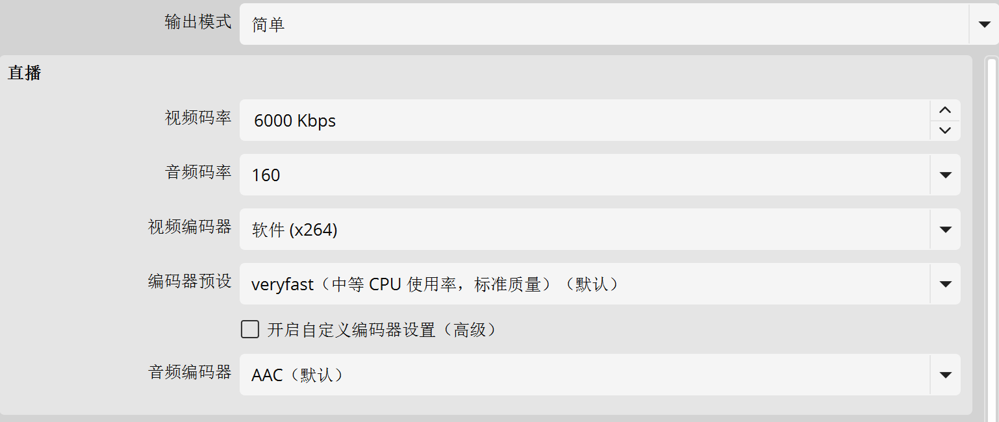

音频设置应该不需要更改，48kHz立体声即可，视频选择输出格式为1920×1080的60FPS

> [!NOTE]
>
> **建议在OBS中开启录制**，而不是在直播姬中，主要原因是直播姬的视频编码有问题，可能在一些软件上无法正常播放或者处理

在"工具"里面配置WebSocket服务器设置，选择“开启WebSocket服务器”，关闭“开启身份验证”，服务器端口选择4455

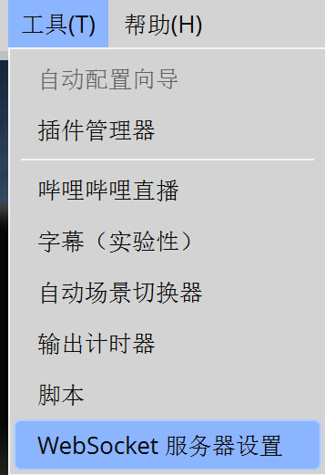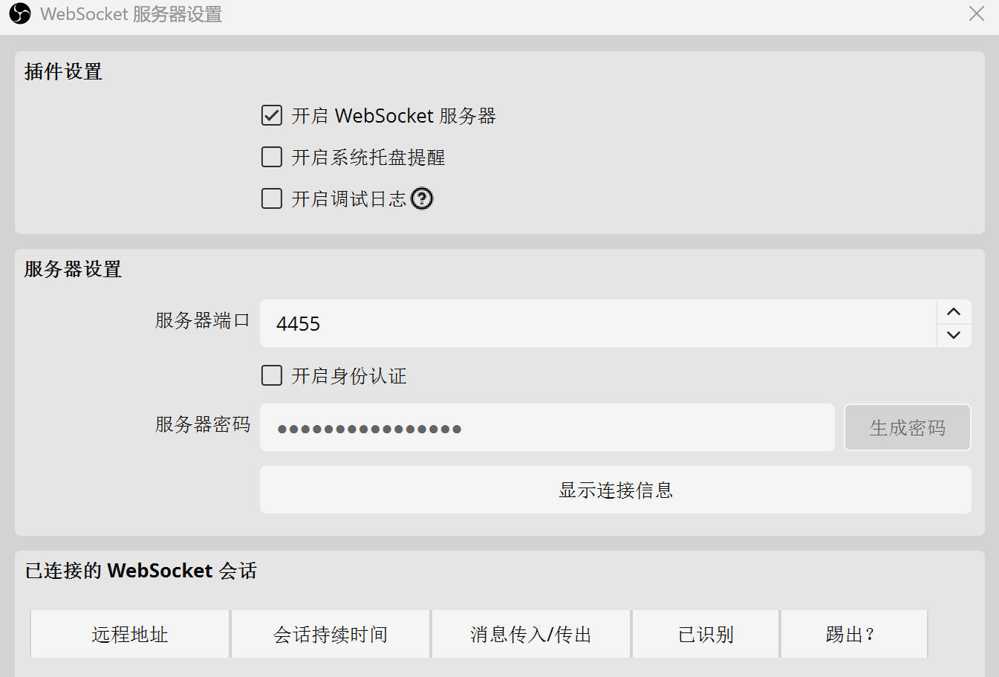

#### 场景资源

接下来添加场景预设并布置场景。场景在“场景集合”里面进行导入，选择“导入”之后选择仓库下`\Broadcast\未命名.json`即可一键导入所有场景。**如果提示缺少资源文件，只需要让他在`\Broadcast`文件夹下面自动寻找**

导入场景之后应该有如下的场景部署

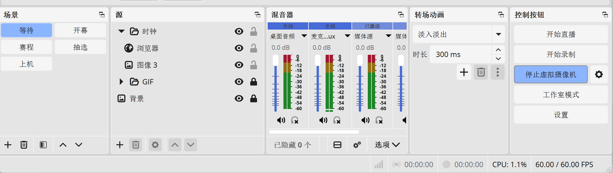

- 等待：一个计时钟，在每一组比赛的间隔播放，**等待环节不需要录制**

  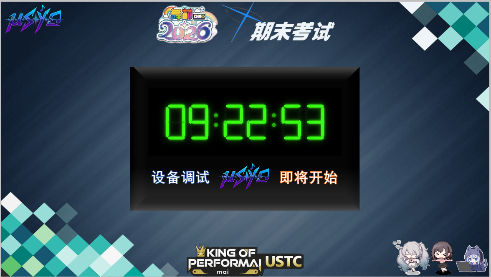

- 开幕：主摄像头，横构图，用来每组比赛进入第一个回合之前的环节

  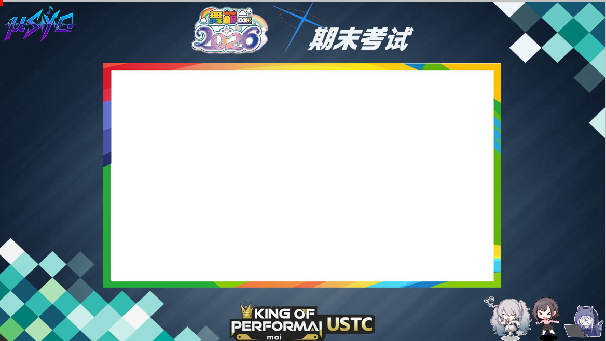

- 赛程：比赛的选手以及进度，在每一回合开始或者结束之前展示

  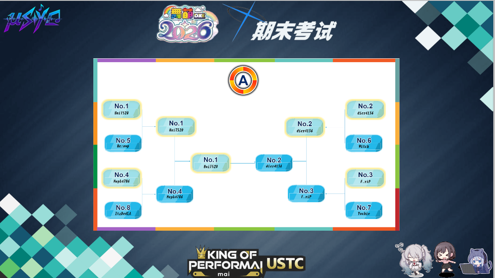

- 抽选：实际上比赛没有了抽选环节，所以这部分相当于介绍本回合选手、回合结束的感言、每组决赛结束后的颁奖，这部分中间也是一个横构图的主摄像头

  

- 上机：比赛的核心环节，直播舞萌手元

  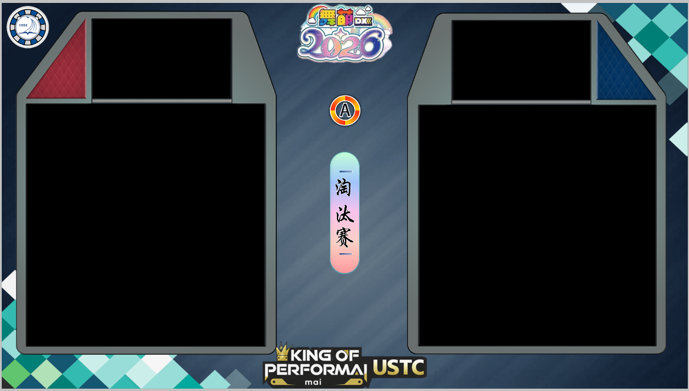

  另外转场动画里面还有一个视频转场，也可以拿出来试试

> [!NOTE]
>
> 场景中的摄像头和音频还需要在赛场上进行绑定。绑定的方法就是
>
> - 选择上机场景，看到两个DroidCam源和音频输入采集
> - 分别右键进入设置绑定三个源，其中第一个DroidCam源同时担当主摄**（如果主摄使用第三个摄像头替代，需要进行对应的调整）**
> - 调整位置和缩放大小
>
> 直播中**蓝牙麦克风作为唯一的音频输入**，如果需要绑定机台的推流，**推流的音频仅在上机环节采集输入**
>
> 实际上比赛阶段并不需要进入OBS进行切换场景，所有流程在前端即可完成

## 程序使用

### 前端部署

在新电脑上克隆或复制项目后，建议在项目根目录创建 Python 虚拟环境：

```powershell
py -3 -m venv .venv
.\.venv\Scripts\Activate.ps1
python -m pip install --upgrade pip
python -m pip install -r requirements.txt
```

网页控制台依赖在 `Clock-main` 目录安装：

```powershell
cd .\Clock-main
npm ci
Copy-Item .env.example .env
npm run dev
```

**默认访问地址是 `http://localhost:3000/`**，OBS 浏览器源里的时钟地址是 `http://localhost:3000/clock`

`Clock-main\.env` 中可以按需设置：

```powershell
PYTHON_PATH="../.venv/Scripts/python.exe"
OBS_WS_URL="ws://127.0.0.1:4455"
OBS_WS_PASSWORD=""
```

OBS 场景集合在 `Broadcast\未命名.json`。如果项目没有放在原来的 `E:\USTCop\USTCop-Livecast` 路径，导入后需要在 OBS 中重新定位 `Broadcast` 目录下的图片、GIF 和 WebM 素材，并重新选择麦克风、DroidCam、采集卡等设备源

### 功能说明

启动前端之后，浏览器可以打开http://localhost:3000/，访问前端控制页面

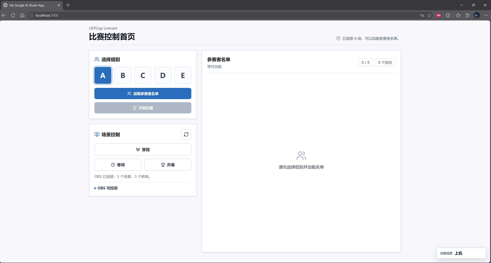

可以先试试切换场景看一下是否能够成功控制OBS直播程序

参赛名单放在文件夹下`GroupA~GroupE.xlsx`里面，前端在比赛进行的时候会自动写入剩下的数据。前端里面的数据缓存重置是在每次点击加载参赛者名单的时候，不会重置Excel表格

加载完选手之后即可开始比赛

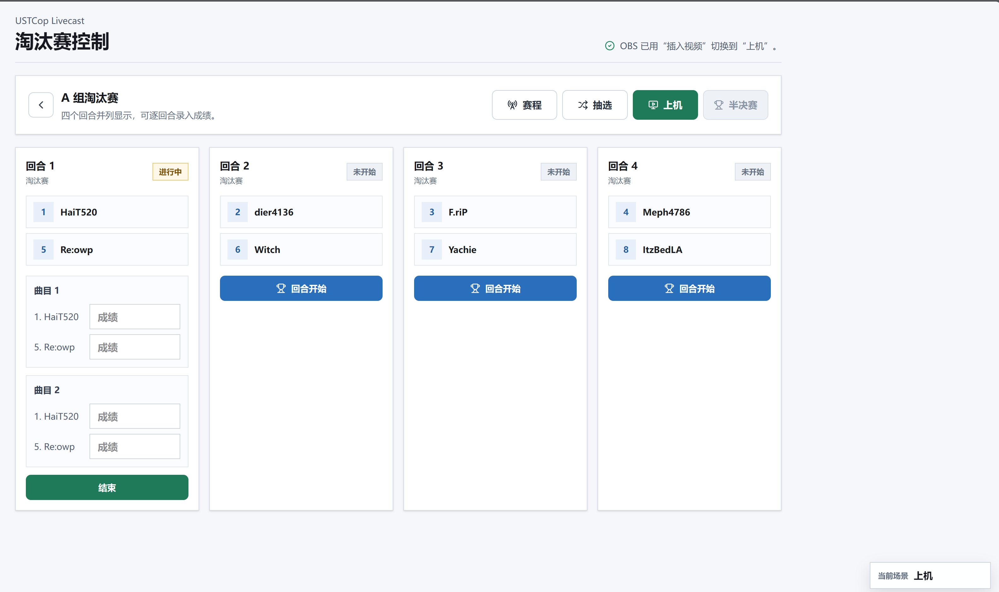

比赛分为淘汰赛、半决赛和决赛三个轮次，在决赛结束之后返回第一页

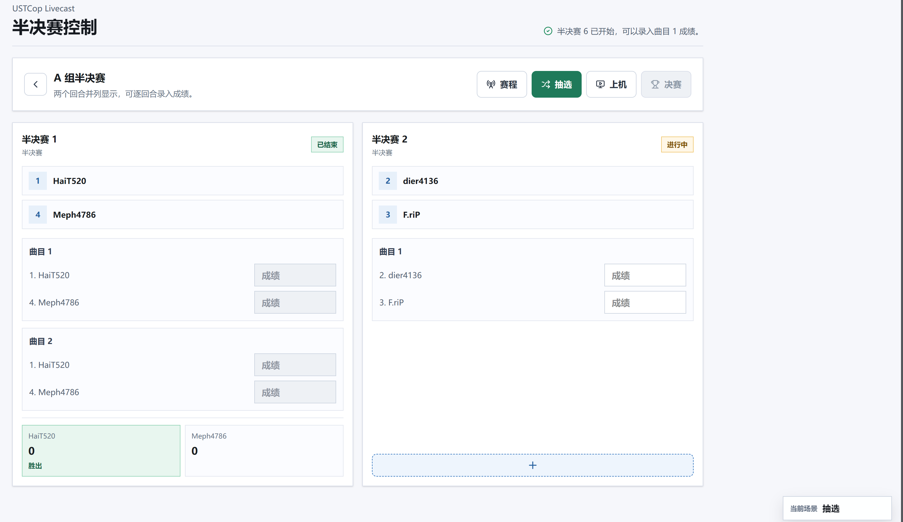

可以提前看一下每个页面每个键实现了什么功能，基本上和上一次USTCop的直播流程一样，这次大部分都实现了自动化。**不过比赛期间的场景需要手动切换，这个需要注意**

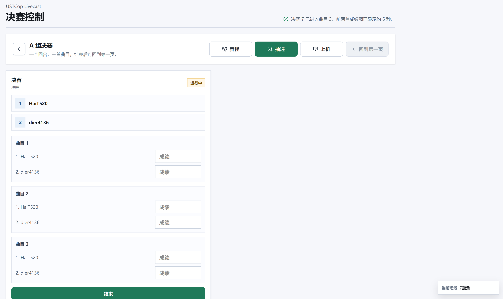

> [!IMPORTANT]
>
> 最后预祝各位staff圆满举办比赛，祝各位选手玩得开心、玩出精彩
